# Twitter/X thread - "Weights or Skills?" (arXiv 2608.01851)

One tweet per figure (Figures 1-11) + a links tweet. **Every figure now has a zoom-tour video** (`figures/<name>_tour.mp4`) plus a looping GIF (`figures/<name>_tour.gif`); the static still (`figures/<name>.png`) is a backup. The GIF is embedded under each tweet so you can eyeball, in Markdown preview, whether the post correlates with its motion.

- **Paper:** "Weights or Skills? A Survey of Robot-Learning Techniques"
- **Authors:** Gaytri Jena, Kapil Wanaskar, Vinija Jain, Aman Chadha, Vasu Sharma, Amitava Das (Jena et al.)
- **arXiv:** https://arxiv.org/abs/2608.01851 · **DOI:** 10.5281/zenodo.21764307 · **Site:** https://kapilw25.github.io/surveys/p1_weights_or_skills/

> Tours were rendered at 600 DPI through the full paper (all citations + section refs resolve), 1920x1080 MP4 (H.264) + 640px GIF. Attach the **MP4** on X / LinkedIn (autoplays; video gets the most reach). Open this file in a Markdown preview (VS Code: `Cmd+Shift+V`) to watch the GIFs loop.

---

## The thread

### Tweet 1 - Fig 1: "Weights or Skills?" collage  [tour: left/right poles]

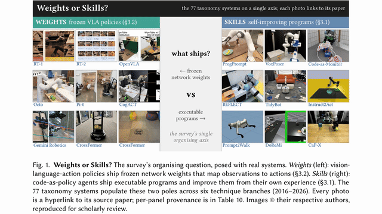

Attach `figures/fig_corpus_collage_tour.mp4`.

```
Weights or Skills?

Robots today ship one of two things: frozen network weights (VLA policies, left) or executable skills they write and improve themselves (code-as-policy, right).

We put all 77 core systems on that single axis. A thread, one figure at a time 👇
```

### Tweet 2 - Fig 2: weights-vs-skills taxonomy  [tour: crane down 7 branches]

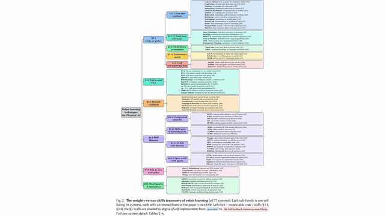

Attach `figures/fig_taxonomy_main_tour.mp4` (the taxonomy is unreadable as a still, so the video is essential here).

```
The map: 77 systems, 6 technique branches, 2016-2026.

The code-as-policy branch splits into 5 rungs of self-improvement, shaded from zero-shot (13 systems) up to the full feedback+memory+search loop (just 3).

This is the survey's hero taxonomy.
```

### Tweet 3 - Fig 3: related-surveys timeline  [tour: pan across]

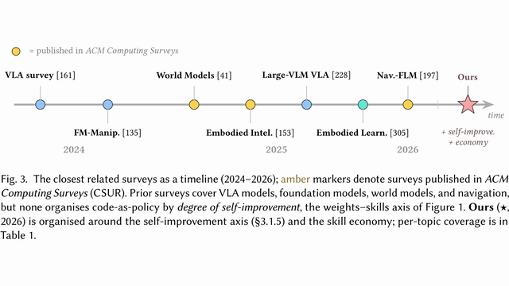

Attach `figures/fig_survey_timeline_tour.mp4`.

```
How is this different from prior surveys?

Others cover VLAs, foundation models, world models, navigation. None organizes code-as-policy by *degree of self-improvement*, the weights-to-skills axis.

That empty cell is what we fill (star, 2026).
```

### Tweet 4 - Fig 4: PRISMA corpus construction  [tour: crane down the flow]

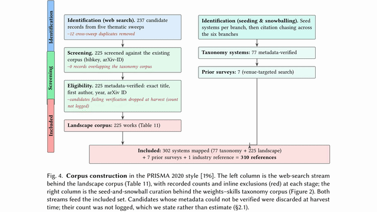

Attach `figures/fig_prisma_tour.mp4`.

```
How we built the corpus (PRISMA-2020):

237 candidates -> minus 12 duplicates -> 225 verified landscape works, plus 77 taxonomy systems + 7 prior surveys.

310 references, 302 systems. Unverifiable metadata was dropped at harvest; we say so rather than estimate.
```

### Tweet 5 - Fig 5: corpus at a glance  [tour: callouts then bars]

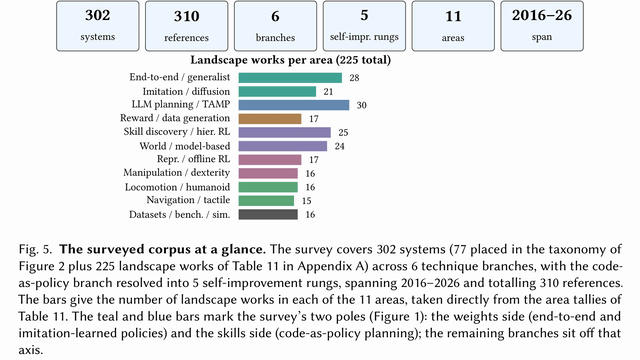

Attach `figures/fig_corpus_overview_tour.mp4`.

```
The corpus at a glance:

302 systems, 310 refs, 6 branches, 5 self-improvement rungs, 11 capability areas, 2016-2026.

Bars = landscape works per area. Biggest: LLM planning/TAMP (30), end-to-end policies (28), skill discovery + hierarchical RL (25).
```

### Tweet 6 - Fig 6: profile of the 225 landscape works  [tour: 4 quadrants]

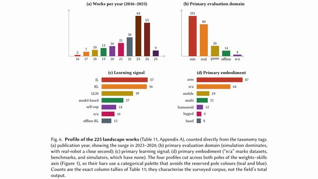

Attach `figures/fig_corpus_dist_tour.mp4`.

```
Profile of the 225 landscape works:

- Year: big surge in 2023 (64) and 2024 (53)
- Domain: simulation 101, real-robot 80
- Signal: imitation 57, RL 56, LLM 39
- Embodiment: robot arm 87 dominates

A field still mostly in sim, mostly arms.
```

### Tweet 7 - Fig 7: the two poles over time  [tour: gentle zoom]

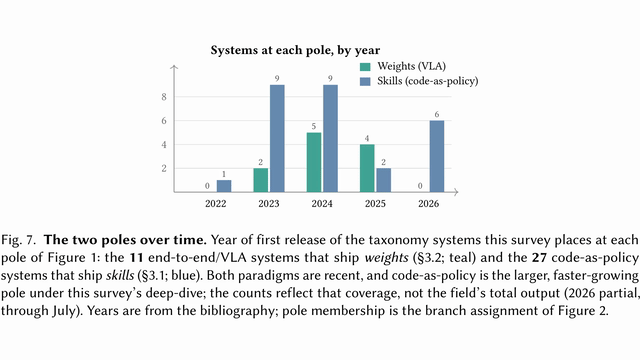

Attach `figures/fig_pole_trend_tour.mp4`.

```
The two poles over time:

11 systems ship *weights* (end-to-end / VLA, teal).
27 ship *skills* (code-as-policy, blue).

Both paradigms are recent, but the skills pole is the larger and faster-growing one under our deep-dive.
```

### Tweet 8 - Fig 8: robots across the systems  [tour: crane down 3 bands]

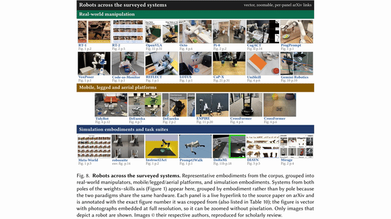

Attach `figures/fig_robots_canvas_tour.mp4`.

```
The robots behind the survey: real-world manipulators, mobile/legged/aerial platforms, and simulation embodiments.

Every tile is a live link to its source paper, tagged with the exact figure it was cropped from. Vector, so you can zoom in with no pixelation.
```

### Tweet 9 - Fig 9: results reported across the systems  [tour: crane down 3 bands]

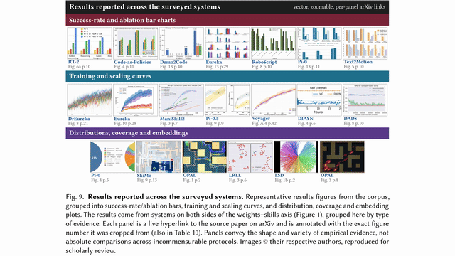

Attach `figures/fig_plots_canvas_tour.mp4`.

```
And the evidence they report: success-rate/ablation bars, training + scaling curves, and distribution/coverage/embedding plots.

Grouped by *type of evidence*, not by score (protocols across these systems aren't directly comparable). Every panel links to its paper.
```

### Tweet 10 - Fig 10: the full self-improving loop  [tour: pan across]

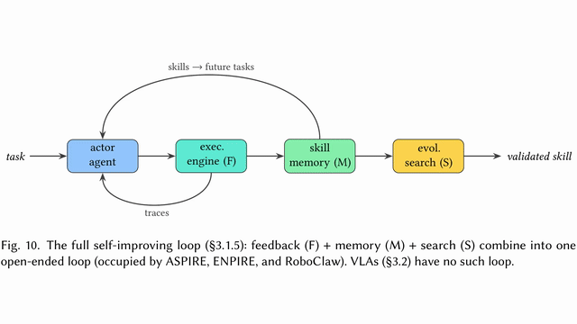

Attach `figures/fig_architectures_tour.mp4`.

```
What does a fully self-improving robot loop look like?

Feedback (F) + Memory (M) + Search (S), closed into one open-ended loop, occupied so far by just 3 systems (ASPIRE, ENPIRE, RoboClaw).

VLAs have no such loop. That's the frontier.
```

### Tweet 11 - Fig 11: future evaluation protocol  [tour: 4 quadrants]

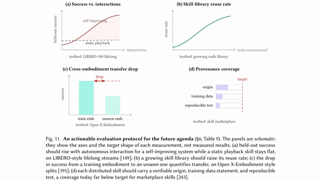

Attach `figures/fig_future_protocol_tour.mp4`.

```
Where next? An evaluation protocol (these panels are schematic: target shapes, not results):

(a) success vs autonomous interactions
(b) skill-library reuse rate
(c) cross-embodiment transfer drop
(d) provenance coverage

Testbeds: LIBERO, Open X-Embodiment.
```

### Tweet 12 - links + co-authors (no image)

```
Full survey: "Weights or Skills?"

Paper: arxiv.org/abs/2608.01851
Site: kapilw25.github.io/surveys/p1_weights_or_skills/
DOI: 10.5281/zenodo.21764307

With @Gaytri Jena, @Vinija Jain, @Aman Chadha, @Vasu Sharma, @Amitava Das. Feedback welcome.

#Robotics #MachineLearning
```

---

## Quick reference: tweet -> tour (all in `figures/`)

| Tweet | Attach (MP4) | GIF | Still | Camera | Dur |
|---|---|---|---|---|---|
| 1 | `fig_corpus_collage_tour.mp4` | `..._tour.gif` | `fig_corpus_collage.png` | left/right poles | 8.3s |
| 2 | `fig_taxonomy_main_tour.mp4` | `..._tour.gif` | `fig_taxonomy_main.png` | crane down (7) | 18.8s |
| 3 | `fig_survey_timeline_tour.mp4` | `..._tour.gif` | `fig_survey_timeline.png` | pan across | 10.4s |
| 4 | `fig_prisma_tour.mp4` | `..._tour.gif` | `fig_prisma.png` | crane down | 10.4s |
| 5 | `fig_corpus_overview_tour.mp4` | `..._tour.gif` | `fig_corpus_overview.png` | callouts -> bars | 8.3s |
| 6 | `fig_corpus_dist_tour.mp4` | `..._tour.gif` | `fig_corpus_dist.png` | 4 quadrants | 12.5s |
| 7 | `fig_pole_trend_tour.mp4` | `..._tour.gif` | `fig_pole_trend.png` | gentle zoom | 6.2s |
| 8 | `fig_robots_canvas_tour.mp4` | `..._tour.gif` | `fig_robots_canvas.png` | crane down (3 bands) | 10.4s |
| 9 | `fig_plots_canvas_tour.mp4` | `..._tour.gif` | `fig_plots_canvas.png` | crane down (3 bands) | 10.4s |
| 10 | `fig_architectures_tour.mp4` | `..._tour.gif` | `fig_architectures.png` | pan across | 10.4s |
| 11 | `fig_future_protocol_tour.mp4` | `..._tour.gif` | `fig_future_protocol.png` | 4 quadrants | 12.5s |

## Before you post
- **Attach the MP4** (`figures/<name>_tour.mp4`) to each tweet; the GIF is a fallback (all under X's 15 MB limit), the `.png` a static backup.
- Each tour was **frame-verified** against its source figure (correct content, readable text).
- **Swap in real @handles** for the co-authors (the plain-text names will not notify anyone).
- **Every number is verbatim** from the paper's captions/tables (302 systems, 310 refs, 77 taxonomy, 225 landscape, 11 vs 27 poles) - no invented stats.
- **Links tweet last** on purpose (X down-ranks outbound links in the first tweet).
